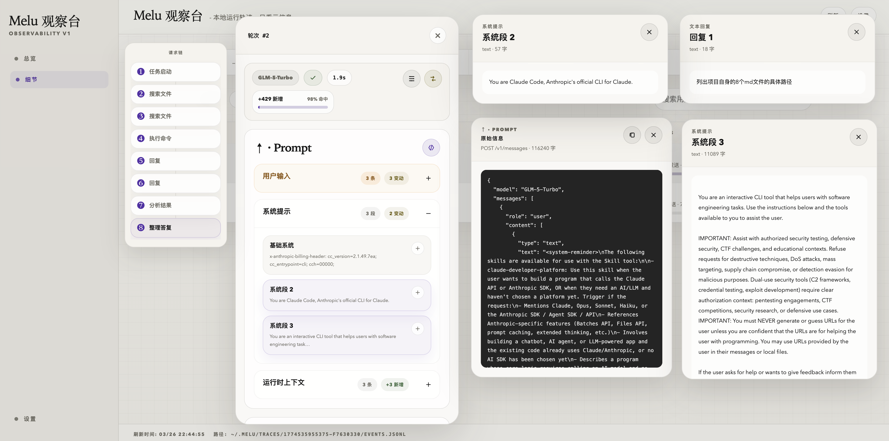
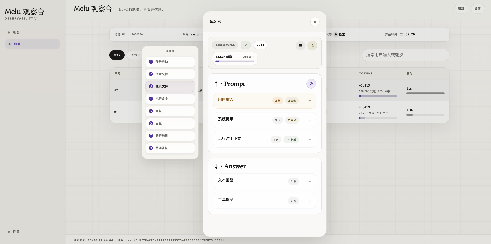
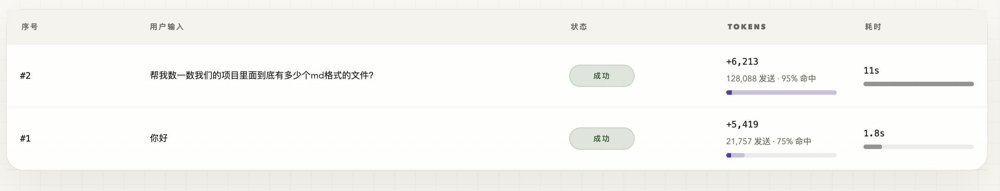
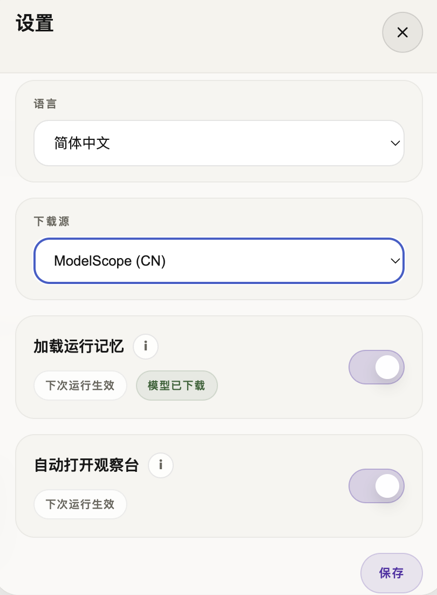

[English](./README.en.md)

# Melu

**让 Claude Code 拥有本地长期记忆与可视化观察台。**

Melu 是一个运行在 Claude Code 与 Anthropic Messages API 之间的本地代理。  
它一边拦截请求、可视化展示每一轮发生了什么，一边在你需要时为后续会话注入长期记忆。

## 三行上手

```bash
npm install -g @hope666/melu
melu init
melu run -- claude
```

推荐使用 `Node.js v22.22.2 LTS`。

安装后，Melu 会：

- 本地启动代理，不改你的 Claude Code 用法
- 默认打开观察台页面，直接看请求、耗时、Prompt、Answer、工具调用
- 可选开启长期记忆模块，让后续会话继续记住你

## 这是什么

Melu 主要解决两件事：

1. **让 Claude Code 更透明**
   你可以直接看到每一轮请求的状态、耗时、Token、请求链、Prompt 包装方式，以及模型到底返回了什么。
2. **让 Claude Code 可选拥有长期记忆**
   你可以开启本地记忆模块，Melu 会把相关记忆注入到后续请求里；也可以完全关闭，只保留观察台。

## 核心功能

### 1. 本地观察台

- 总览页直接看运行状态、请求量、成功率、Token 和请求密度
- 细节页能逐轮展开，查看每一轮请求链和具体结构
- `↑ · Prompt` 看上传给模型前是怎么包装的
- `↓ · Answer` 看模型返回的文本回复和工具指令
- 所有数据都在本地，不依赖额外云端分析服务




### 2. 请求链可视化

- 不再只看“发了几次请求”，而是直接看 Claude Code 在每一步到底做了什么
- 能看到任务启动、搜索文件、执行命令、分析结果、整理答复这类链路
- 点开每一个节点，还能继续看对应的 Prompt / Answer 细节



### 3. Token 与缓存命中一眼看清

- 每一轮的新增 Token、发送量、缓存命中率、耗时都能对照着看
- 更适合排查“为什么这轮特别贵”“为什么这轮突然变慢”



### 4. 可选的本地长期记忆

- 记忆模块是**可选开启**的，不想用就完全关闭
- 首次初始化时就可以选择是否启用
- 设置面板里也可以随时改，下次运行生效
- 开启后会使用本地 embedding 模型做检索，不会把这部分能力外包给别的云服务



## 怎么用

最常见的流程就是：

1. `melu init`
2. `melu run -- claude`
3. 正常使用 Claude Code

如果你只想用观察台，不想要记忆：

```bash
melu config memory off
melu run -- claude
```

如果你想重新打开记忆：

```bash
melu config memory on
```

如果你不想每次自动弹出观察台：

```bash
melu config dashboard off
```

## 工作原理

Melu 的运行方式很直接：

- `melu run -- claude` 会先启动本地代理
- Claude Code 的 Anthropic 请求会先经过 Melu
- Melu 在本地记录 trace，并把结果展示到观察台
- 如果记忆模块已开启，Melu 会检索本地记忆并注入到后续请求里
- 同时后台会提取新的长期记忆，写回本地 SQLite `.memory` 文件

你不需要改 Claude Code 的工作方式，也不需要手动维护一堆 Prompt 模板。

## 关于记忆模块

记忆模块不是强制的，它是一个可选能力。

开启后，Melu 会：

- 下载并使用本地 embedding 模型
- 在请求阶段检索相关记忆
- 在后台提取新的长期记忆
- 将记忆保存在你本机的 SQLite `.memory` 文件里

关闭后，Melu 仍然可以继续作为：

- 本地代理
- 本地观察台
- 请求可视化工具

也就是说，你可以把它理解为：

**Melu = 观察台基础能力 + 可选长期记忆能力**

## 常用命令

```bash
melu init
melu run -- claude
melu stop
melu status
melu list
melu config show
melu config memory on
melu config memory off
melu config dashboard on
melu config dashboard off
```

完整命令说明可以看 npm 页面：

- [npm: @hope666/melu](https://www.npmjs.com/package/@hope666/melu)

## 代码仓库

- GitHub: [github.com/Hyp6666/melu](https://github.com/Hyp6666/melu)
- Issues: [github.com/Hyp6666/melu/issues](https://github.com/Hyp6666/melu/issues)

## 许可

[Apache-2.0](./LICENSE)
